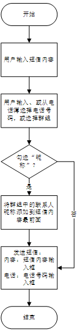
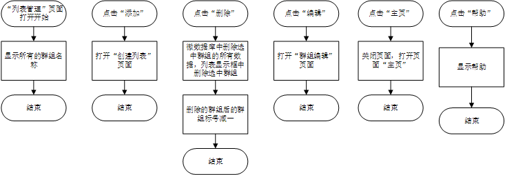
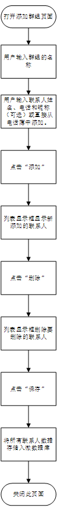
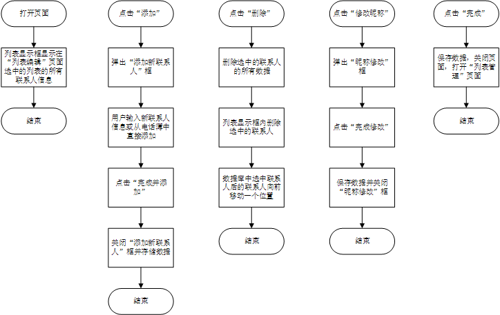

# 
具体功能模块设计

---

* **发送短信**

　　此功能为应用的基本功能。其他模块中对于列表的管理和编辑，在这个模块得到应用。流程图如下：

* **列表管理**

　　此功能为应用的核心功能。用于对现有列表的显示和管理。并且实现基本功能“发送短信”和其他功能的对接。流程图如下：

* **列表创建**

　　此功能实现新列表的创建。流程图如下：

* **列表编辑**

　　此功能实现对已有列表的重新编辑功能。流程图如下：

