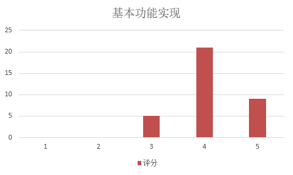
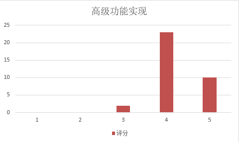
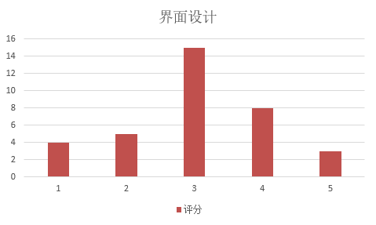
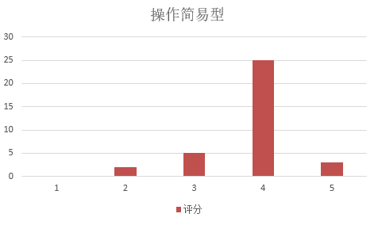
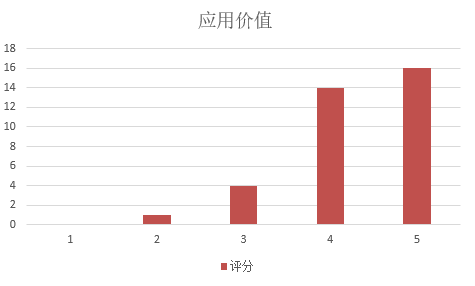

# 
反馈

---

　　我们对35位试用者者采取了问卷调查和一对一采访的形式。  　　**试用者分布:**

|  
**试用者** | 
**人数** | 

**占比**|
| -- | -- | -- |
| 
学生会 | 
15 | 
42.86% |
| 
助教| 
5 | 
14.26% |
| 
快递小哥 | 
1 | 
2.86% |
| 
其他| 
14 | 
14.00% |
 
　　**问卷设计：** 
　　试用者在试用应用后，分别就“基本功能实现”、“高级功能实现”、“界面设计”、“操作简易型”、“应用价值”5个问题打分，从1到5代表评价从高到低。 
　　**调查结果：** 

* 基本功能实现

　　平均分4.11
　
* 高级功能实现

　　平均分4.23

* 界面设计

　　平均分3.03

* 操作简易型

　　平均分3.83

* 应用价值

　　平均分4.26   

　　**结果分析**

　　总的来说，大部分试用者对于此应用的使用情况较为满意。基本功能设计合理，模块分布较为均匀和谐；特色功能实用、方便，具有亲和力；界面设计较为简洁；操作简单，较易上手；应用整体实用性较强，对于目标群体的工作、生活具有较大的帮助。 
　　同时，从反馈结果上看，我们的设计也存在较多的问题。主要问题如下： 
　　1. 部分功能有小BUG，但不影响使用。 
　　2. 界面设计过于单调，不具有亲和性。 
　　3. 基本功能过于繁杂，特色功能不突出。 
　　4. 部分界面具有重复性，建议考虑将界面合并。 
　　5. 没有开始界面。 
　　6. 功能仍待添加。 
