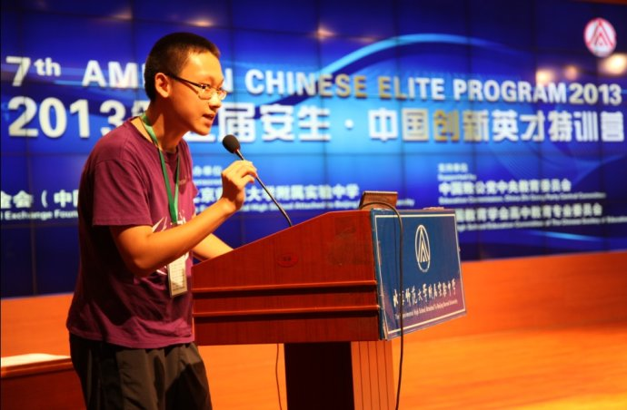

# 
团队介绍和人员分工

---

* **孙岵** 　　　　王亚南经济研究院本科国际班2014级    　　　　152201422018

分工： 
主程序流程设计； 
高级功能实现； 
程序debug; 
用户反馈信息收集。

* **齐斌**　　　　 王亚南经济研究院本科国际班2014级 　　　　15220142201833

分工： 
主程序流程设计； 
主要功能实现； 
数据存储形式设计; 
界面设计。 
项目报告的撰写。
